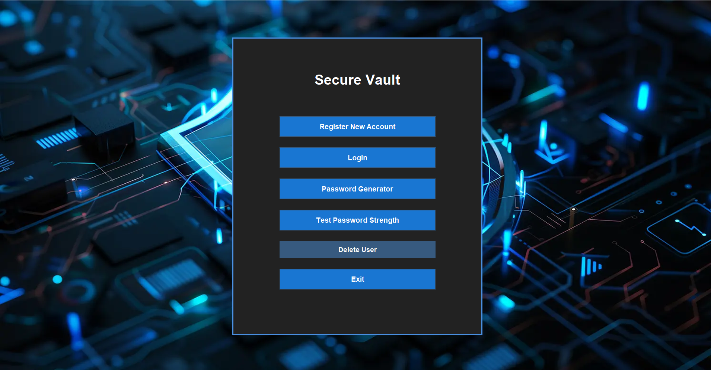
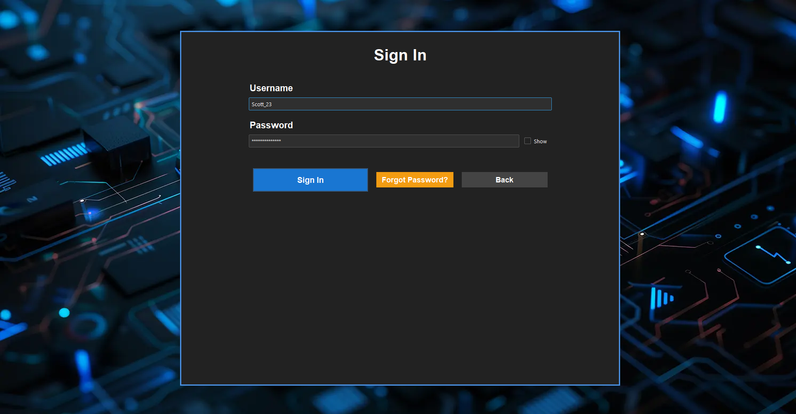
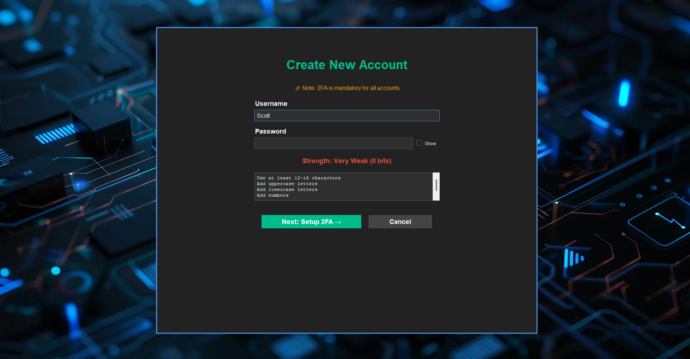
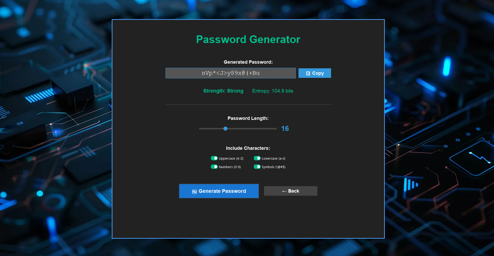
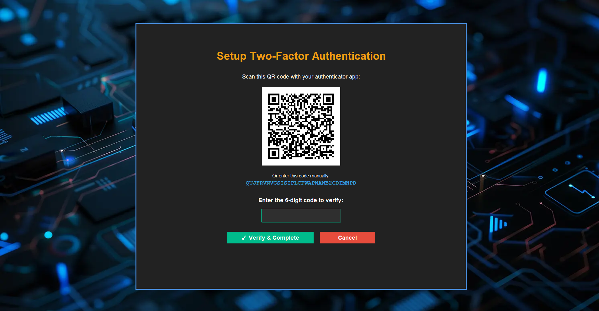
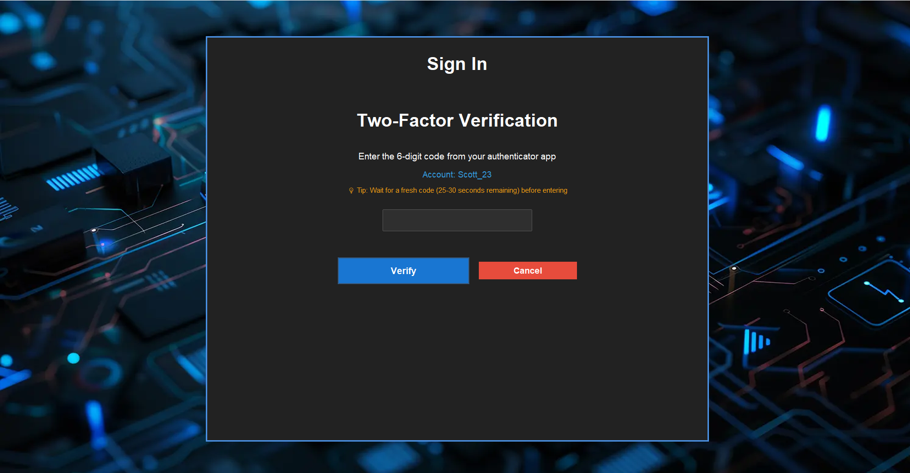
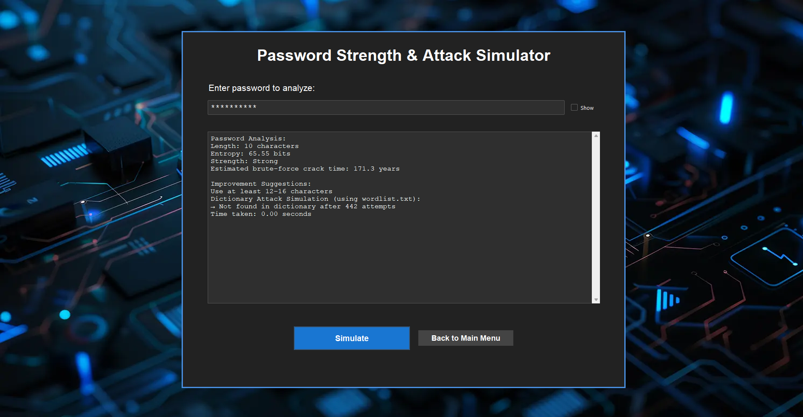
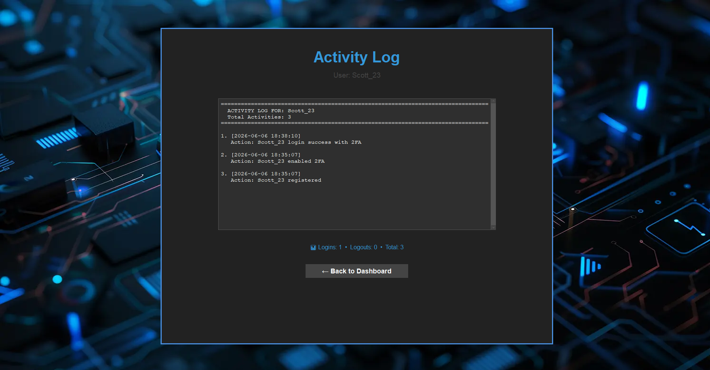

# 🔐 Secure File Vault

A Python desktop application for secure file storage using **AES-256 encryption**. Features bcrypt password hashing, TOTP-based 2FA with QR code setup, password strength analyzer, session auto-timeout, and a brute-force attack simulator.

---

## 📸 Screenshots

| Home Page | Login |
|---|---|
|  |  |

| Registration | Password Generator |
|---|---|
|  |  |

| 2FA QR Code Setup | 2FA Verification |
|---|---|
|  |  |

| Attack Simulator | Activity Log |
|---|---|
|  |  |

---

## 🚀 Features

- 🔒 **AES-256 Encryption** — File encryption/decryption using Fernet (cryptography library)
- 🔑 **bcrypt Password Hashing** — Secure password storage with salted hashing
- 📱 **TOTP-Based 2FA** — Two-factor authentication with QR code setup via pyotp
- 💪 **Password Strength Analyzer** — Entropy-based strength calculation with real-time feedback
- ⏱️ **Session Auto-Timeout** — Automatic logout on inactivity with warning prompt
- 🛡️ **Brute-Force Attack Simulator** — Simulate dictionary and brute-force attacks for testing
- 🔧 **Secure Password Generator** — Generate cryptographically strong passwords
- 📋 **Activity Log** — Track all user actions and security events
- 💾 **Backup Manager** — Manage encrypted file backups

---

## 🛠️ Built With

| Technology | Purpose |
|---|---|
| Python 3.10+ | Core application language |
| Tkinter | GUI framework |
| ttkbootstrap | Modern themed UI components |
| cryptography (Fernet) | AES-256 file encryption/decryption |
| bcrypt | Password hashing |
| pyotp | TOTP-based 2FA |
| qrcode | QR code generation for 2FA setup |

---

## 📁 Project Structure

```
Secure_File_Vault/
├── main.py                         # Entry point
├── core/
│   ├── security.py                 # Encryption, hashing, password analysis
│   ├── vault.py                    # File add/retrieve/delete logic
│   ├── authentication.py           # Login, register, 2FA verification
│   ├── session_manager.py          # Session timeout & activity tracking
│   ├── backup_manager.py           # Encrypted backup management
│   └── attack_simulator.py         # Brute-force & dictionary attack simulator
├── gui/
│   ├── gui_config.py               # Theme & background configuration
│   ├── gui_main_menu.py            # Main menu screen
│   ├── gui_login.py                # Login screen
│   ├── gui_register.py             # Registration & 2FA setup screen
│   ├── gui_enhanced_dashboard.py   # Main vault dashboard
│   ├── gui_file_manager.py         # File browser with search
│   ├── gui_vault_screens.py        # Vault file operations UI
│   ├── gui_security_screens.py     # 2FA & attack simulator UI
│   ├── gui_password_generator.py   # Password generator screen
│   ├── gui_activity_log.py         # Activity log viewer
│   ├── gui_change_password.py      # Change password screen
│   ├── gui_reset_password.py       # Reset password screen
│   └── gui_delete_user.py          # Delete account screen
├── assets/
│   └── cyber-security-concept-digital-art.png  # Background image
├── screenshots/                    # App screenshots (add yours here)
├── requirements.txt
├── .gitignore
├── LICENSE
└── README.md
```

---

## ⚙️ Setup & Installation

### Prerequisites
- Python 3.10 or higher
- pip

### Steps

1. **Clone the repository**
   ```bash
   git clone https://github.com/Haroon0805/Secure-File-Vault.git
   cd Secure-File-Vault
   ```

2. **Install dependencies**
   ```bash
   pip install -r requirements.txt
   ```

3. **Run the application**
   ```bash
   python main.py
   ```

> ⚠️ A `vault_storage/` directory is auto-created on first run to store encrypted files. Never share or expose this folder.

---

## 🔐 Security Notes

- All files are encrypted with **AES-256 (Fernet)** before storage
- Passwords are **never stored in plaintext** — bcrypt hashing with salt is used
- 2FA secrets are stored per-user and verified at login
- Session auto-timeout triggers after a configurable inactivity period
- The brute-force simulator is for **educational/testing purposes only**

---

## 👨‍💻 Author

**Muhammad Haroon**
- GitHub: [@Haroon0805](https://github.com/Haroon0805)
- LinkedIn: [mharoon0805](https://linkedin.com/in/mharoon0805)
- Email: m.haroon.0805@gmail.com

---

## 📄 License

This project is licensed under the MIT License. See the [LICENSE](LICENSE) file for details.
